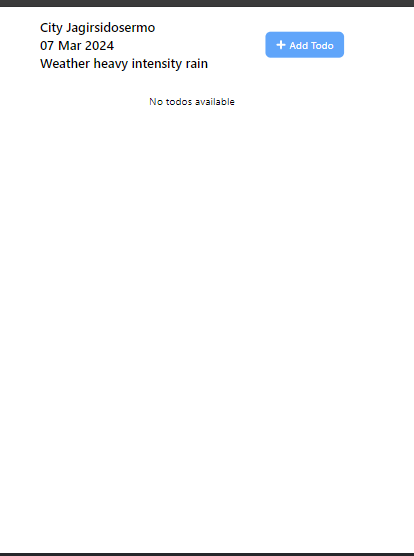
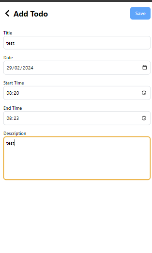
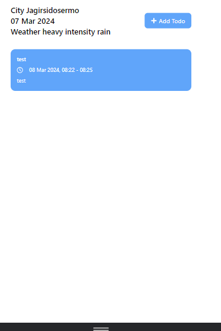

# Todo App

Aplikasi Todo sederhana yang memungkinkan pengguna untuk menambahkan, menghapus, dan melihat daftar tugas yang harus dilakukan.

## Fitur

- Menambahkan tugas baru
- Menghapus tugas yang sudah selesai
- Menampilkan daftar tugas

## Teknologi

- React.js
- Redux untuk manajemen state aplikasi
- Redux Saga untuk middleware
- Tailwind CSS untuk styling
- Moment.js untuk manipulasi waktu
- OpenWeatherMap API untuk informasi cuaca

## Instalasi

1. Clone repository ini ke komputer Anda.
2. Buka terminal dan navigasi ke direktori proyek.
3. Jalankan perintah `yarn` untuk menginstal semua dependensi.
4. Jalankan perintah `yarn start` untuk menjalankan aplikasi.

## Screenshot

### Tampilan Utama

### Menambahkan Tugas Baru

### Tampilan Cuaca Berdasarkan Lokasi Pengguna

## Lisensi

Distributed under the MIT License. See `LICENSE` for more information.
